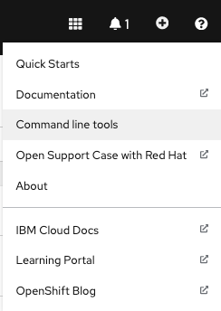

# Cloud Native Toolkit - GitOps Production Deployment Guide

The GitOps concept originated from [Weaveworks](https://www.weave.works/) back in 2017 and the goal was to automate the operations of a Kubernetes (K8s) system using a model external to the system as the source of truth ([History of GitOps](https://www.weave.works/blog/the-history-of-gitops)).

This repository provides our opinionated point of view on how `GitOps` can be used to manage the infrastructure, services and application layers of K8s based systems.  It takes into account the various personas interacting with the system and accounts for separation of duties.  The instructions and examples are focused around the [Red Hat OpenShift](https://cloud.redhat.com/learn/what-is-openshift) platform and [IBM Cloud Paks](https://www.ibm.com/cloud/paks).

The reference architecture for this GitOps workflow can be found [here](https://cloudnativetoolkit.dev/adopting/use-cases/gitops/gitops-ibm-cloud-paks/).


## Table of contents
- [Cloud Native Toolkit - GitOps Production Deployment Guide](#cloud-native-toolkit---gitops-production-deployment-guide)
  - [Table of contents](#table-of-contents)
  - [Pre-requisites](#pre-requisites)
    - [Red Hat OpenShift cluster](#red-hat-openshift-cluster)
    - [CLI tools](#cli-tools)
    - [IBM Entitlement Key](#ibm-entitlement-key)
  - [Setup git repositories](#setup-git-repositories)
    - [Tasks:](#tasks)
  - [Install and configure OpenShift GitOps](#install-and-configure-openshift-gitops)
    - [Tasks:](#tasks-1)
  - [Bootstrap the OpenShift cluster](#bootstrap-the-openshift-cluster)
    - [Tasks:](#tasks-2)
  - [Select resources to deploy](#select-resources-to-deploy)
    - [Tasks:](#tasks-3)


## Pre-requisites

### Red Hat OpenShift cluster
- An OpenShift v4.7+ cluster is required.

### CLI tools
- Install the [git CLI](https://github.com/git-guides/install-git).
    - Configure your username for your Git commits - [link](https://docs.github.com/en/get-started/getting-started-with-git/setting-your-username-in-git).
    - Configure your email for your Git commits - [link](https://docs.github.com/en/account-and-profile/setting-up-and-managing-your-github-user-account/managing-email-preferences/setting-your-commit-email-address).
- Install the OpenShift CLI oc (version 4.7+) .  The binary can be downloaded from the Help menu from the OpenShift Console.
    <details>
    <summary>Download oc cli</summary>

    
    </details>
- Log in from a terminal window.
    ```bash
    oc login --token=<token> --server=<server>
    ```

### IBM Entitlement Key
- The `IBM Entitlement Key` is required to pull IBM Cloud Pak specific container images from the IBM Entitled Registry.  To get an entitlement key,

    1. Log in to [MyIBM Container Software Library](https://myibm.ibm.com/products-services/containerlibrary) with an IBMid and password associated with the entitled software.
    2. Select the **View library** option to verify your entitlement(s).
    3. Select the **Get entitlement key** to retrieve the key.

- A **Secret** containing the entitlement key is created in the `tools` namespace.

    ```bash
    oc new-project tools || true
    oc create secret docker-registry ibm-entitlement-key -n tools \
    --docker-username=cp \
    --docker-password="<entitlement_key>" \
    --docker-server=cp.icr.io
    ```

## Setup git repositories
- The following set of Git repositories will be used for our GitOps workflow.
    - Main GitOps repository ([https://github.com/cloud-native-toolkit/multi-tenancy-gitops](https://github.com/cloud-native-toolkit/multi-tenancy-gitops)): This repository contains all the ArgoCD Applications for  the `infrastructure`, `services` and `application` layers.  Each ArgoCD Application will reference a specific K8s resource (yaml resides in a separate git repository), contain the configuration of the K8s resource, and determine where it will be deployed into the cluster.
    - Infrastructure GitOps repository ([https://github.com/cloud-native-toolkit/multi-tenancy-gitops-infra](https://github.com/cloud-native-toolkit/multi-tenancy-gitops-infra)): Contains the YAMLs for cluster-wide and/or infrastructure related K8s resources managed by a cluster administrator.  This would include `namespaces`, `clusterroles`, `clusterrolebindings`, `machinesets` to name a few.
    - Services GitOps repository ([https://github.com/cloud-native-toolkit/multi-tenancy-gitops-services](https://github.com/cloud-native-toolkit/multi-tenancy-gitops-services)): Contains the YAMLs for K8s resources which will be used by the `application` layer.  This could include `subscriptions` for Operators, YAMLs of custom resources provided, or Helm Charts for tools provided by a third party.  These resource would usually be managed by the Administrator(s) and/or a DevOps team supporting application developers.

### Tasks:
1. Create a new GitHub Organization using instructions from this [GitHub documentation](https://docs.github.com/en/organizations/collaborating-with-groups-in-organizations/creating-a-new-organization-from-scratch).
2. From each template repository, click the `Use this template` button and create a copy of the repository in your new GitHub Organization.
    
3. Clone the repositories locally.
    ```bash
    mkdir -p gitops-repos
    cd gitops-repos
    # Clone using SSH
    git clone git@github.com:<GIT_ORG>/multi-tenancy-gitops.git
    git clone git@github.com:<GIT_ORG>/multi-tenancy-gitops-infra.git
    git clone git@github.com:<GIT_ORG>/multi-tenancy-gitops-services.git
    ```
3. Update the default Git URl and branch references in your `multi-tenancy-gitops` repository by running the provided script `./scripts/set-git-source.sh` script.
    ```bash
    cd multi-tenancy-gitops
    GIT_ORG=<GIT_ORG> GIT_BRANCH=master ./scripts/set-git-source.sh
    git commit -m "Update Git URl and branch references"
    git push origin master
    ```


## Install and configure OpenShift GitOps
- [Red Hat OpenShift GitOps](https://docs.openshift.com/container-platform/4.7/cicd/gitops/understanding-openshift-gitops.html) uses [Argo CD](https://argoproj.github.io/argo-cd/), an open-source declarative tool, to maintain and reconcile cluster resources.

### Tasks:
1. Install the OpenShift GitOps Operator, create a `ClusterRole` and deploy a default instance of ArgoCD.
    ```bash
    oc apply -f setup/ocp47/
    while ! oc wait crd applications.argoproj.io --timeout=-1s --for=condition=Established  2>/dev/null; do sleep 30; done
    while ! oc wait pod --timeout=-1s --for=condition=Ready -l '!job-name' -n openshift-gitops > /dev/null; do sleep 30; done
    ```
1. Delete the default ArgoCD instance
    ```bash
    oc delete gitopsservice cluster -n openshift-gitops || true
    oc delete argocd openshift-gitops -n openshift-gitops || true
    ```
1. Create a custom ArgoCD instance with custom checks
    ```bash
    oc apply -f setup/ocp47/argocd-instance/ -n openshift-gitops
    while ! oc wait pod --timeout=-1s --for=condition=ContainersReady -l app.kubernetes.io/name=openshift-gitops-cntk-server -n openshift-gitops > /dev/null; do sleep 30; done
    ```


## Bootstrap the OpenShift cluster
- The bootstrap YAML follows the [app of apps pattern](https://argoproj.github.io/argo-cd/operator-manual/cluster-bootstrapping/#app-of-apps-pattern).

### Tasks:
1. Select a profile and delete the others from the `0-bootstrap` directory.  If this is your first usage of the gitops workflow, use the `single-cluster` profile and deploy the ArgoCD Bootstrap Application.
    ```bash
    GITOPS_PROFILE="0-bootstrap/single-cluster"
    oc apply -f ${GITOPS_PROFILE}/bootstrap.yaml
    ```
2. Retrieve the ArgoCD/GitOps URL and admin password:
    ```bash
    oc get route -n openshift-gitops openshift-gitops-cntk-server -o template --template='https://{{.spec.host}}'
    oc extract secrets/openshift-gitops-cntk-cluster --keys=admin.password -n openshift-gitops --to=-
    ```


## Select resources to deploy
- Clone the `multi-tenancy-gitops` repository in your Git Organization if you have not already done so and select the K8s resources to deploy in the [infrastructure](0-bootstrap/single-cluster/1-infra/kustomization.yaml) and [services](0-bootstrap/single-cluster/2-services/kustomization.yaml) layers.
- Existing recipes are available and additional ones will be made available in the **doc** directory.
    - [Cloud Native Toolkit](doc/cloud-native-toolkit-recipe.md)
    - [App Connect Enterprise recipe](doc/ace-recipe.md)
    - [MQ recipe](doc/mq-recipe.md)
    - [API Connect recipe](doc/apic-recipe.md)
    - [Process Mining recipe](doc/process-mining-recipe.md)
    - [Cloud Pak for Data](doc/cp4d-platform-recipe.md)
    - [Cloud Pak for Data + Watson Studio](doc/cp4d-ws-recipe.md)
    - [Cloud Pak for Data + Watson Knowledge Catalog](doc/cp4d-wkc-recipe.md)
    - [Cloud Pak for Data + DataStage](doc/cp4d-ds-recipe.md)
    - [Cloud Pak for Data + Analytics Engine Powered by Apache Spark](doc/cp4d-aespark-recipe.md)
    - [Cloud Pak for Security](doc/cp4s-recipe.md)
    - [Instana Agent](doc/instana-recipe.md)
    - [Spectrum Protect Plus](doc/spp-recipe.md)
    - [Sterling File Gateway](doc/sfg-recipe.md)

### Tasks:
1. Select a profile and delete the others from the `0-bootstrap` directory.  If this is your first usage of the gitops workflow, Use the `single-cluster` profile.
    ```bash
    GITOPS_PROFILE="0-bootstrap/single-cluster"
    ```
2. Review the `Infrastructure` layer [kustomization.yaml](0-bootstrap/single-cluster/1-infra/kustomization.yaml) and un-comment the resources to deploy.
3. Review the `Services` layer [kustomization.yaml](0-bootstrap/single-cluster/2-services/kustomization.yaml) and un-comment the resources to deploy.
4. Commit and push changes to your git repository
    ```bash
    git add .
    git commit -m "initial bootstrap setup"
    git push origin
    ```
5. Validate the recipe was deployed correctly following the `Validation` section in the recipe.
