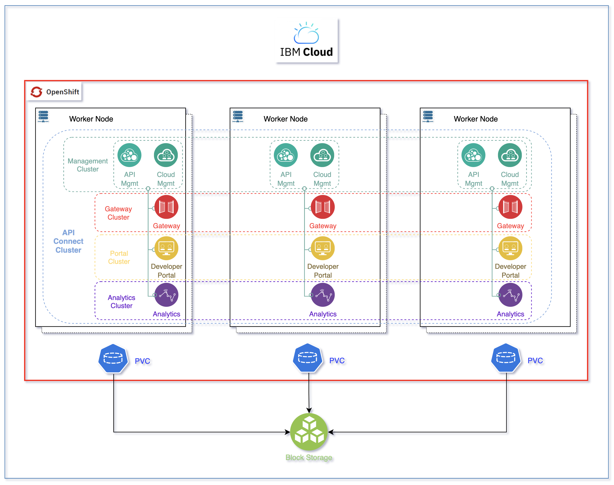

# Deploy Cloud Pak for Integration - IBM API Connect capability

## Overview

This IBM API Connect recipe should provide a highly available deployment of IBM API Connect on a Red Hat OpenShift Kubernetes Service on IBM Cloud as shown below.



### Infrastructure - kustomization.yaml
1. Edit the Infrastructure layer `${GITOPS_PROFILE}/1-infra/kustomization.yaml` and un-comment the following:
    ```yaml
    - argocd/namespace-ibm-common-services.yaml
    - argocd/namespace-tools.yaml
    - argocd/namespace-ci.yaml
    ```

### Services - kustomization.yaml
1. Edit the Services layer `${GITOPS_PROFILE}/2-services/kustomization.yaml` uncomment the following:
    ```yaml
    - argocd/operators/ibm-apic-operator.yaml
    - argocd/instances/ibm-apic-instance.yaml
    - argocd/operators/ibm-datapower-operator.yaml
    - argocd/operators/ibm-foundations.yaml
    - argocd/operators/ibm-catalogs.yaml
    ```

#### Storage - ibm-apic-instance.yaml
1. Make sure the `storageClassName` specified in `${GITOPS_PROFILE}/2-services/argocd/instances/ibm-apic-instance.yaml`, which defaults to the **`ibmc-block-gold`**, corresponds to an available **block** storage class in the cluster you are executing this recipe in.

#### High Availability - ibm-apic-instance.yaml
1. Make sure the `profile` specified in `${GITOPS_PROFILE}/2-services/argocd/instances/ibm-apic-instance.yaml`, which defaults to the **`n3xc14.m48`**, corresponds to the desired profile: development vs production.

    * `n1xc10.m48` - Deploys 1 replica of each pod, so this profile is most suitable for a small, non-HA system. Recommended use of this profile is for development and testing.

    * `n3xc14.m48` - Deploys 3 or more replicas of each pod, so this profile is most suitable for larger systems and for production environments. This profile is supported for installation on a cluster with three or more nodes. It is not supported on a cluster with fewer than three nodes.

    **IMPORTANT:** Make sure the Red Hat OpenShift cluster you are deploying this IBM API Connect recipe to has been sized appropriately based on the profiles above where:

      * `n` stands for the number of worker nodes.
      * `c` stands for the amount of CPU per worker node.
      * `m` stands for the amount of RAM per worker node.

### Validation
1. Make sure that the phase in which the IBM API Connect cluster is at is `Ready`
    ```bash
    # Get IBM API Connect cluster phase
    oc get APIConnectCluster apic-cluster -n tools -o=jsonpath='{.status.phase}'
    # Expected output
    Ready
    ```

1. Make sure that the state in which the IBM API Connect cluster installation is at is `4/4`
    ```bash
    # Get IBM API Connect cluster state
    oc get APIConnectCluster apic-cluster -n tools -o=jsonpath='{.status.state}'
    # Expected output
    4/4
    ```

1. You can now access your IBM API Connect Cloud Manager
    ```bash
    # Get IBM API Connect Cloud Manager URL
    oc get APIConnectCluster apic-cluster -n tools -o=jsonpath='{.status.endpoints[?(@.name=="admin")].uri}'
    ```

1. The credentials for logging into the IBM API Connect Cloud Manager are `admin/<password>` where password is stored in a secret.
   ```bash
   # Get IBM API Connect Cloud Manager password
   oc get secret apic-cluster-mgmt-admin-pass -n tools -o=jsonpath='{.data.password}' | base64 -D
   ```