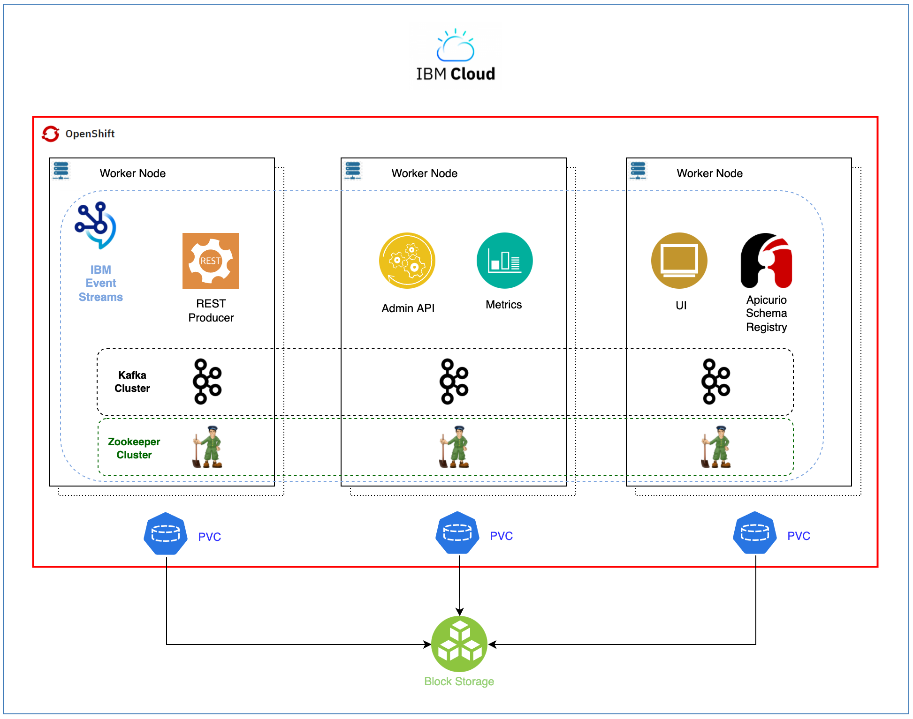

# Deploy Cloud Pak for Integration - IBM Event Streams capability

## Overview

This IBM Event Streams recipe should provide a highly available deployment of IBM Event Streams on a Red Hat OpenShift Kubernetes Service on IBM Cloud as shown below.



### Infrastructure - kustomization.yaml
1. Edit the Infrastructure layer `${GITOPS_PROFILE}/1-infra/kustomization.yaml` and un-comment the following:
    ```yaml
    - argocd/namespace-ibm-common-services.yaml
    - argocd/namespace-tools.yaml
    ```

### Services - kustomization.yaml
1. Edit the Services layer `${GITOPS_PROFILE}/2-services/kustomization.yaml` uncomment the following:
    ```yaml
    - argocd/operators/ibm-eventstreams-operator.yaml
    - argocd/instances/ibm-eventstreams-instance.yaml
    - argocd/operators/ibm-foundations.yaml
    - argocd/instances/ibm-foundational-services-instance.yaml
    - argocd/operators/ibm-catalogs.yaml
    ```

#### Storage - ibm-eventstreams-instance.yaml
Make sure the `storageClassName` specified in `${GITOPS_PROFILE}/2-services/argocd/instances/ibm-eventstreams-instance.yaml` suits your needs. By default, the storage class used for this recipe, which should be the storage class requested unless the use case or specific requirements dictate otherwise, is **`managed-nfs-storage`** since the IBM Technology Zone environments this recipe is meant for mount NFS storage. If you are using this recipe and the GitOps Framework that executes this recipe on another environment, make sure you select the appropriate storage class. Bear in mind that IBM Event Streams requires **block storage**.

#### High Availability - ibm-apic-instance.yaml
Make sure the high availability specified in `${GITOPS_PROFILE}/2-services/argocd/instances/ibm-eventstreams-instance.yaml` for each of the IBM Event Streams components suit your needs.

   * The Kafka and Zookeeper components are already set up highly available as you can see within `spec.strimziOverrides.kafka.replicas` and `spec.strimziOverrides.zookeeper.replicas` respectively.
   * The IBM Event Streams UI, the IBM Event Streams Apicurio Registry, the IBM Event Streams Admin API, the IBM Event Streams REST Producer and the IBM Event Streams Metrics Collector components can also be set up for high availability in their respective `spec.adminUI`, `spec.apicurioRegistry`, `spec.adminApi`, `spec.restProducer` and `spec.collector` sections by specifying the number of replicas for those too. By default, since no specific number of replicas is specified, only one pod for each of the aforementioned components will be deployed.

#### Security - ibm-eventstreams-instance.yaml
Make sure the security mechanisms to access Kafka suit your needs. IBM Event Streams provides different listeners within the `spec.strimziOverrides.kafka.listeners`:
   1. One external which will be SSL secured (`external`)
   2. Two internal listeners, one SSL secured (`tls`) and one non-SSL secured (`plain`)

All of these listeners can get configured for authentication, either SCRAM (`scram-sha-512`) or mTLS (`tls`). For more information, refer to the _Kafka access_ section in the official IBM Event Streams documentation [here](https://ibm.github.io/event-streams/installing/configuring/).

### Validation

After some time, you can validate your new instance of IBM Event Streams is ready by executing:

```
oc get eventstreams -n tools
```

Expected output is

```
NAME             STATUS
es-inst          Ready
```

You can now access your IBM API Connect Cloud Manager

```
oc get EventStreams es-inst -n tools -o=jsonpath='{.status.endpoints[?(@.name=="ui")].uri}'
```

The credentials for logging into the IBM API Connect Cloud Manager are `admin/<password>` where password is stored in a secret.

```
oc get secret platform-auth-idp-credentials -n ibm-common-services -o=jsonpath='{.data.admin_password}' | base64 -D
```