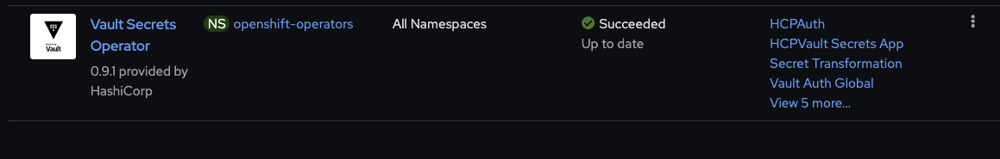
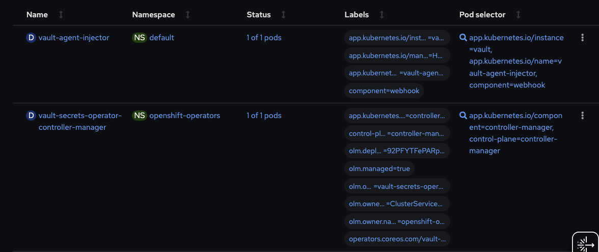
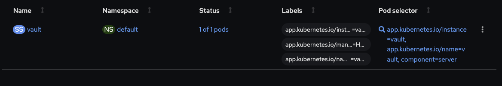
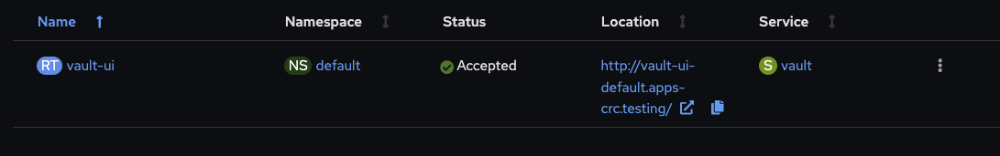

# Deploy [IBM Vault ](https://www.vaultproject.io/)

This recipe is for deploying the IBM Vault in a single namespace (i.e. `vault`) 

### Infrastructure - Kustomization.yaml
1. Edit the Infrastructure layer `${GITOPS_PROFILE}/1-infra/kustomization.yaml`, un-comment the following lines, commit and push the changes and synchronize the `infra` Application in the ArgoCD console.

    ```bash        
    cd multi-tenancy-gitops/0-bootstrap/single-cluster/1-infra
    ```

    ```yaml
    - argocd/consolenotification.yaml
    - argocd/namespace-ibm-common-services.yaml
    - argocd/namespace-sealed-secrets.yaml
    - argocd/namespace-vault.yaml
    - argocd/serviceaccounts-ibm-common-services.yaml
    - argocd/serviceaccounts-vault.yaml
    ```
    >  💡 **NOTE**  
    > Commit and Push the changes for `multi-tenancy-gitops` & go to ArgoCD, open `infra` application and click refresh.
    > Wait until everything gets deployed before moving to the next steps.

### Services - Kustomization.yaml

1. This recipe is can be implemented using a PVC that requires to identify a storage class for it. please go to `${GITOPS_PROFILE}/multi-tenancy-gitops-services/instances/ibm-vault-setup/storage` and update the yaml line `13` by uncommenting the storage class and adding the correct storage class name after the `=` no `"` needed!
i.e
    | Component | Access Mode | IBM Cloud | OCS/ODF |
    | --- | --- | --- | --- |
    | PVCPersistentVolumeClaim | ReadWriteOnce | managed-nfs-storage | ocs-storagecluster-cephfs |

1. Edit the Services layer `${GITOPS_PROFILE}/2-services/kustomization.yaml` and install Sealed Secrets by uncommenting the following line, **commit** and **push** the changes and refresh the `services` Application in the ArgoCD console.
   
    ```yaml
    ## HashiCorp Integration 
    - argocd/operators/ibm-vault-operator.yaml

    # Sealed Secrets
    - argocd/instances/sealed-secrets.yaml
    ```
<details>
  <summary> Operator Screenshot </summary>

   

</details>

</br>

>  💡 **NOTE**  
> Commit and Push the changes for `multi-tenancy-gitops` & go to ArgoCD, open `services` application and click refresh.
> Wait until everything gets deployed before moving to the next steps.

1. Edit the Services layer `${GITOPS_PROFILE}/2-services/kustomization.yaml` and install Sealed Secrets by uncommenting the following line, **commit** and **push** the changes and refresh the `services` Application in the ArgoCD console.

Deploy the prerequisite for vault by uncommenting the following line from this directory `${GITOPS_PROFILE}/2-services/kustomization.yaml`

```bash        
    cd multi-tenancy-gitops/0-bootstrap/single-cluster/2-services
```

```yaml
    - argocd/instances/ibm-vault-setup.yaml
```  
<details>
  <summary> PVC Screenshot </summary>

   
   
</details>

</br>

>  💡 **NOTE**  
> Commit and Push the changes for `multi-tenancy-gitops` & go to ArgoCD, open `services` application and click refresh.
> Wait until everything gets deployed before moving to the next steps.

1. Edit the Services layer `${GITOPS_PROFILE}/2-services/kustomization.yaml` by uncommenting the following line to install Sterling File Gateway, **commit** and **push** the changes and refresh the `services` Application in the ArgoCD console:

    ```yaml
    - argocd/instance/ibm-vault-deploy.yaml
    ```

<details>
  <summary> Deployment & Statefulset Screenshots </summary>
   
   
    </br>
   
   

   
</details>

</br>

>  💡 **NOTE**  
> Commit and Push the changes for `multi-tenancy-gitops` and
> sync ArgoCD application `services` layer.

### Validation

1.  Access your Vault UI:

    ```bash
    oc get route -n vault vault-ui -o template --template='https://{{.spec.host}}'
    ```
</br>

<details>
  <summary> Route Screenshot </summary>
   
    

</details>