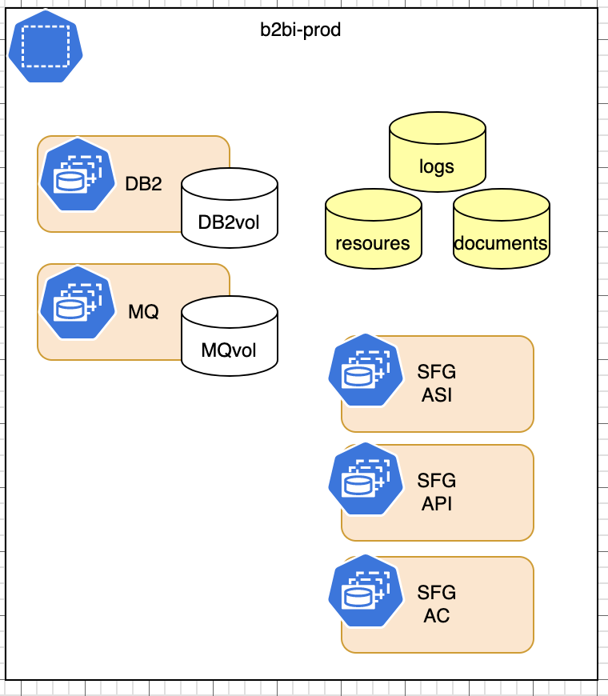

# Deploy [Sterling File Gateway](https://developer.ibm.com/components/sterling/tutorials/)

This recipe is for deploying the B2BI Sterling File Gateway in a single namespace (i.e. `b2bi-prod`): 



### Infrastructure - Kustomization.yaml
1. Edit the Infrastructure layer `${GITOPS_PROFILE}/1-infra/kustomization.yaml`, un-comment the following lines, commit and push the changes and synchronize the `infra` Application in the ArgoCD console.

    ```bash        
    cd multi-tenancy-gitops/0-bootstrap/single-cluster/1-infra
    ```

    ```yaml
    - argocd/consolenotification.yaml
    - argocd/namespace-b2bi-prod.yaml
    - argocd/namespace-sealed-secrets.yaml
    - argocd/serviceaccounts-b2bi-prod.yaml
    - argocd/sfg-b2bi-clusterwide.yaml
    - argocd/daemonset-sync-global-pullsecret.yaml
    ```

### Services - Kustomization.yaml

1. This recipe is can be implemented using a combination of storage classes. Not all combination will work, the following table lists the storage classes that we have tested to work:

    | Component | Access Mode | IBM Cloud | OCS/ODF |
    | --- | --- | --- | --- |
    | DB2 | RWO | ibmc-block-gold | ocs-storagecluster-cephfs |
    | MQ | RWO | ibmc-block-gold | ocs-storagecluster-cephfs |
    | SFG | RWX | managed-nfs-storage | ocs-storagecluster-cephfs |

1. Edit the Services layer `${GITOPS_PROFILE}/2-services/kustomization.yaml` and install Sealed Secrets by uncommenting the following line, **commit** and **push** the changes and refresh the `services` Application in the ArgoCD console.
    ```yaml
    - argocd/instances/sealed-secrets.yaml
    ```

    >  💡 **NOTE**  
    > Commit and Push the changes for `multi-tenancy-gitops` & sync ArgoCD. 

1. Clone the services repo for GitOps, open a terminal window and clone the `multi-tenancy-gitops-services` repository under your Git Organization.
        
    ```bash
    git clone git@github.com:${GIT_ORG}/multi-tenancy-gitops-services.git
    ```

2. Modify the B2BI pre-requisites components which includes the secrets and PVCs required for the B2BI helm chart.

    1. Go to the `ibm-sfg-b2bi-prod-setup` directory:

        ```bash
        cd multi-tenancy-gitops-services/instances/ibm-sfg-b2bi-prod-setup
        ```

    1. Generate a Sealed Secret for the credentials.
        ```bash
        B2B_DB_SECRET=db2inst1 \
        JMS_PASSWORD=password JMS_KEYSTORE_PASSWORD=password JMS_TRUSTSTORE_PASSWORD=password \
        B2B_SYSTEM_PASSPHRASE_SECRET=password \
        ./sfg-b2bi-secrets.sh
        ```

    1. Generate Persistent Volume Yamls required by Sterling File Gateway (the default is set in RWX_STORAGECLASS environment variable to `managed-nfs-storage` - if you are installing on ODF, set `RWX_STORAGECLASS=ocs-storagecluster-cephfs`)

        ```bash
        ./sfg-b2bi-pvc-mods.sh
        ```

    >  💡 **NOTE**  
    > Commit and Push the changes for `multi-tenancy-gitops-services` 

1. Enable DB2, MQ and prerequisites in the main `multi-tenancy-gitops` repository

    1. Edit the Services layer `${GITOPS_PROFILE}/2-services/kustomization.yaml` by uncommenting the following lines to install the pre-requisites for Sterling File Gateway.
        ```yaml
        - argocd/instances/ibm-sfg-db2-prod.yaml
        - argocd/instances/ibm-sfg-mq-prod.yaml
        - argocd/instances/ibm-sfg-b2bi-prod-setup.yaml
        ```

    1. **Optional** Modify the DB2 and MQ storage classes to the environment that you use, the files are in `${GITOPS_PROFILE}/2-services/argocd/instances`. Edit `ibm-sfg-db2-prod.yaml` and `ibm-sfg-mq-prod.yaml` to switch the storageClassName if necessary.


    >  💡 **NOTE**  
    > Commit and Push the changes for `multi-tenancy-gitops` and
    > sync the ArgoCD application `services`.
    >
    > Make sure that the sterling toolkit pod does not throw any error.
    > Wait for 5 minutes until the database is fully initialized. 
   
1. Generate Helm Chart values.yaml for the Sterling File Gateway Helm Chart in the `multi-tenancy-gitops-services` repo; note that the default storage class is using `managed-nfs-storage` - if you are installing on ODF, set `RWX_STORAGECLASS=ocs-storagecluster-cephfs`.

    ```
    cd multi-tenancy-gitops-services/instances/ibm-sfg-b2bi-prod
    ./ibm-sfg-b2bi-overrides-values.sh
    ```

    >  💡 **NOTE**  
    > Commit and Push the changes for `multi-tenancy-gitops-services` 

1. Edit the Services layer `${GITOPS_PROFILE}/2-services/kustomization.yaml` by uncommenting the following line to install Sterling File Gateway, **commit** and **push** the changes and refresh the `services` Application in the ArgoCD console:

    ```yaml
    - argocd/instances/ibm-sfg-b2bi-prod.yaml
    ```

    >  💡 **NOTE**  
    > Commit and Push the changes for `multi-tenancy-gitops` and
    > sync ArgoCD application `services` this will take around 1.5 hr for the database setup.

---

> **⚠️** Warning:  
> If you decided to scale the pods or upgrade the verison you should do the following steps:
>> **This is to avoid going through the database setup job again**

- Step 1:
    ```bash
    cd multi-tenancy-gitops-services/instances/ibm-sfg-b2bi-prod
    ```
- Step 2:
  - Inside `values.yaml`, find & set 
        ```bash
        . . .
        datasetup:
          enabled: false
        . . .
        dbCreateSchema: false
        . . .
        ```
- Commit and push the changes for the `multi-tenancy-gitops-services` repo.
---

### Validation

1.  Retrieve the Sterling File Gateway console URL.

    ```bash
    oc get route -n b2bi-prod ibm-sfg-b2bi-prod-sfg-asi-internal-route-dashboard -o template --template='https://{{.spec.host}}'
    ```

2. Log in with the default credentials:  username:`fg_sysadmin` password: `password` 


### Additional instance of Sterling File Gateway

The current setup has an additional set of customized instance of Sterling File Gateway B2BI in `b2bi-nonprod` namespace. Follow the similar proceure above to run the updates for the `b2bi-nonprod` namespace. 
